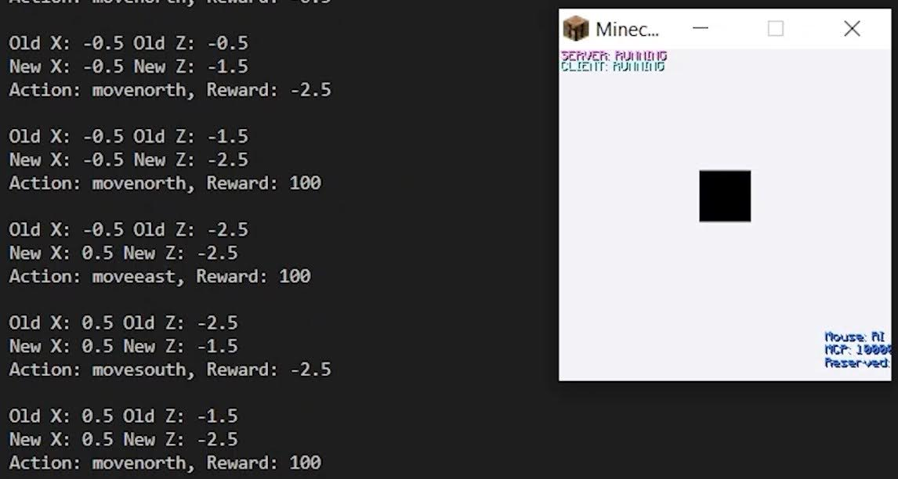

# Minecraft-DQN-Navigator

This utilizes Microsoft's [malmo](https://github.com/microsoft/malmo) platform, which is an interface to interact with Minecraft.

The minigame requires the user to be dropped from a high level after which the user must attempt to maneuver in the air to land in the water to survive. This is done with AI through the use of computer vision, more specifically, by taking frames of the current view of the player in conjunction with the use of Deep-Q Learning and a reward system that highly rewards the AI when it lands in the water.



## Approach

Our approach uses computer vision and Deep Q-Learning. The agent is allowed to make five different actions, a movement in each cardinal direction, as well as not moving at all. The state of the environment is defined by the position and momentum of the agent as well as the position of the pool of water on the ground. The position of the water is randomly selected from a 16 by 16 range. In order to receive the coordinate values of the pool of water, the following function is used:
```python
def generateWater(size):
  waterX = random.randrange(-8, 8)
    waterZ = random.randrange(-8, 8)
    waterX1 = math.floor(waterX - size/2)
    waterX2 = math.floor(waterX + size/2)
    waterZ1 = math.floor(waterZ - size/2)
    waterZ2 = math.floor(waterZ + size/2)
    return waterX1, waterX2, waterZ1, waterZ2
```

The reward function is defined by the distance between the player and the water. There is also a significant reward increase if the player is directly above or in the water. To calculate the reward, the square root of the summed squared difference of the player’s position and water’s position is used. The reward function is defined as the following:
```python
def getReward(waterX, waterZ, playerX, playerZ):
  reward = math.sqrt((playerX-waterX)**2+(playerZ-waterZ)**2)
      	if reward < 0.8:
        		return 100
      	return -reward
```

Every second, we feed the agent a processed video input. We begin by taking a screenshot from the game, then flatten it to grayscale. Since not much detail is needed for all the information about the environment to be interpreted by our AI, we use a smaller video input of 640 x 480 pixels or 307200 independent pixels. This also allows our AI to process information faster. Using Pytorch, we create a tensor using this image to feed into the model.
Our Deep Q-Network references the neural networking framework in the Pytorch library. It consists of 3 convolutional layers and 2 linear fully-connected layers, all using the ReLU activation function. Through the convolutional layers, we increase the number of in and out channels up to 64 and decrease the kernel size and stride. The fully-connected layers output 5 samples, the number of possible inputs our agent can perform.
The image tensor is fed into our model, along with our reward, previous action, and previous image. Through trial and error, the AI learns to associate the water pixels with safety and reward.


## Installation
Follow any of the methods [outlined here](https://github.com/microsoft/malmo?tab=readme-ov-file#getting-started) to setup Malmo.

Once the Malmo client is running:

```
python main.py
```
